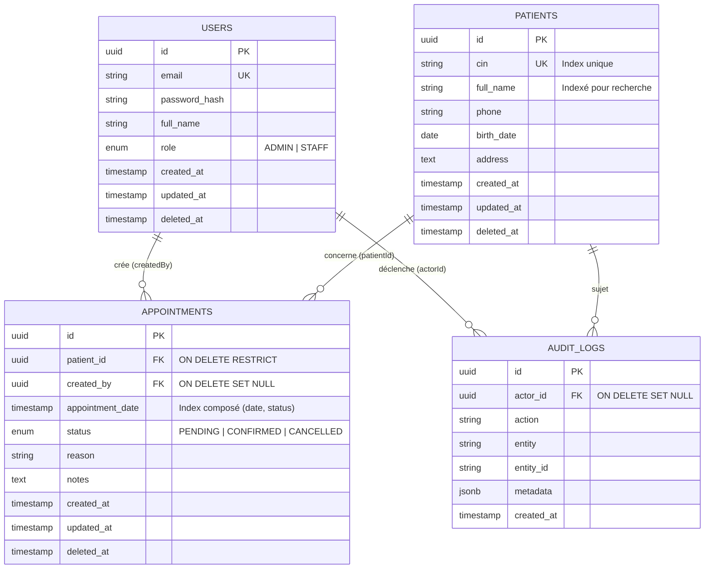

# 🏥 ClinicFlow — Plateforme de Gestion Clinique & Rendez-vous

**ClinicFlow** est une application web médicale complète (PERN Stack) conçue pour la gestion des patients, la planification des rendez-vous et le suivi des indicateurs clés d'une clinique médicale.

Ce projet a été réalisé conformément au cahier des charges du **Test Technique TYTHON**, en adoptant des architectures logicielles d'entreprise :
- **Backend** : **Modular Monolith** avec pattern *Bulletproof Loaders*, séparation en 3 couches (Transport / Service / Données), *AsyncLocalStorage* (AsyncHook), *EventEmitter2* pour les workflows d'audit, et *BullMQ* pour le traitement d'arrière-plan.
- **Frontend** : **Domain-Driven Modular UI** articulé autour du pattern **Component–Pattern–Template (CPT)** sur **Next.js (Pages Router)** avec **TypeScript**, **Mantine UI (v7)**, **Tailwind CSS** et **SWR**.

---

## 📋 Table des Matières

1. [Conception & Schéma Base de Données (ERD)](#-conception--schéma-base-de-données-erd)
2. [Règles Métiers Clés](#-règles-métiers-clés)
3. [Architecture Logicielle](#-architecture-logicielle)
4. [Prérequis](#-prérequis)
5. [Démarrage Rapide via Docker](#-démarrage-rapide-via-docker-recommandé)
6. [Installation Locale Manuelle](#-installation-locale-manuelle)
7. [Données de Test & Comptes Démo](#-données-de-test--comptes-démo)
8. [Tests Automatisés](#-tests-automatisés)
9. [Documentation des Endpoints API](#-endpoints-api-rest)

---

## 🗄️ Conception & Schéma Base de Données (ERD)

### Schéma Relationnel



### Justification des Relations & Contraintes

1. **UUID PK** : Toutes les tables utilisent des identifiants universels UUID (`gen_random_uuid()`) pour éviter les attaques par énumération d'ID séquentiels et garantir une scalabilité sans collision.
2. **`patients.cin` UNIQUE & Indexé** : Le CIN (Carte d'Identité Nationale) est unique par patient. Un index B-Tree garantit des vérifications $O(1)$ à la saisie.
3. **`patients` (1) ➔ `appointments` (N)** avec `ON DELETE RESTRICT` : Les dossiers médicaux et consultations passées ne doivent pas être accidentellement purgés en cascade. La suppression d'un patient s'effectue via un **soft delete** (`deleted_at`), préservant l'intégrité clinique.
4. **`users` (1) ➔ `appointments` (N)** avec `ON DELETE SET NULL` : Si un membre du personnel quitte la clinique, l'historique des rendez-vous des patients reste consultable.
5. **Index de Recherche & Performance** :
   - `patients(full_name)` & `patients(cin)` : Optimisation de la recherche textuelle paginée.
   - `appointments(appointment_date, status)` : Index composé accélérant les requêtes du dashboard ("Rendez-vous du jour" et compteurs de statut).
   - `appointments(patient_id, appointment_date)` : Index dédié à la vérification de conflit en temps réel.
6. **Audit Trail** (`audit_logs`) : Traçabilité des actions critiques (archivage de patient, modification de statut de rendez-vous) déclenchée de façon découplée par des événements de domaine.

---

## ⚖️ Règles Métiers Clés

### Règle des 30 Minutes (Anti-Collision Patient)
> **« Un patient ne peut pas avoir 2 rendez-vous confirmés dans une fenêtre de 30 minutes. »**

Cette règle est validée de façon stricte au niveau du service backend (`AppointmentService.validateNoConflictWindow`) lors de :
1. La création d'un rendez-vous avec le statut `CONFIRMED`.
2. Le changement de statut (`PATCH /api/v1/appointments/:id/status`) vers `CONFIRMED`.

Formule appliquée :
$$\text{Conflit si } \exists \text{ RDV confirmé tel que } |t_{\text{nouveau}} - t_{\text{existant}}| \le 30 \text{ minutes pour le même patient}.$$

Si un conflit est détecté, l'API renvoie un code **HTTP 409 Conflict** explicite.

---

## 🏛️ Architecture Logicielle

### Backend (`clinicflow-api-v1`)
- **Structure par Domaine (Modular Monolith)** :
  Chaque module métier (`patient`, `appointment`, `auth`, `dashboard`) est structuré sans contrôleur externe, avec injection directe dans les routeurs :
  ```
  src/modules/<domaine>/
  ├── models/
  │   └── index.ts        # Exports et typages Prisma/ORM du modèle
  ├── services/
  │   ├── default.ts      # Implémentation du service métier (héritant de BaseService)
  │   └── index.ts        # Export de la classe et de l'instance singleton
  └── index.ts            # Barrel export du module (models, services, validations)
  ```
- **Couche Routage & Transport** (`src/routes/v1/`) : Les gestionnaires de requêtes (validation, extraction des paramètres, appel du service et réponse JSON) résident directement dans les fonctions des routes Express, éliminant la couche de contrôleur redondante.
- **Sécurité** : Hachage des mots de passe avec **bcrypt** (10 rounds), authentification stateless par **JWT**, et contrôle d'accès basé sur les rôles (**RBAC** : suppression de patient réservée à l'administrateur).
- **Contexte Asynchrone** : `AsyncLocalStorage` (`AsyncHook`) propage les métadonnées de requête (`currentUser`, `requestId`) sans polluer les signatures de fonctions.

### Frontend (`clinicflow-platform-v1`)
- **Next.js Pages Router** avec **TypeScript**.
- **Pattern CPT (Component–Pattern–Template)** :
  - **Components** (`modules/*/components/`) : Éléments présentateurs atomiques (`StatusBadge`, `MetricKpiCard`).
  - **Patterns** (`modules/*/patterns/`) : Blocs fonctionnels interactifs (`AppointmentBookingDrawer`, `PatientFormModal`).
  - **Templates** (`modules/*/templates/`) : Vues orchestratrices de pages connectées au state manager.
- **Passerelle API SWR (`router/`)** : Mise en cache intelligente, revalidation en arrière-plan et mutations optimistes.
- **Design Soigné** : Palette clinique sobre (bleu ardoise `#0f172a`, vert émeraude, ambre, sarcelle `#0d9488`), typographie Inter, icônes médicales Tabler Icons (aucun artefact génératif ni icône superflue).

---

## 💻 Prérequis

- **Node.js** >= 20.x
- **npm** >= 10.x ou **yarn**
- **Docker** et **Docker Compose** (pour le déploiement conteneurisé)
- **PostgreSQL** 15+ (si exécution locale sans Docker)

---

## 🐳 Démarrage Rapide via Docker (Recommandé)

Lancez l'ensemble des services (PostgreSQL + Redis + API + Frontend) avec une seule commande à la racine :

```bash
docker compose up --build
```

- **Application Frontend** : [http://localhost:3000](http://localhost:3000)
- **API REST Backend** : [http://localhost:5000/api](http://localhost:5000/api) (et `/api/v1`)
- **Documentation Swagger / OpenAPI** : [http://localhost:5000/api-docs](http://localhost:5000/api-docs) (ou `/docs`)
- **Healthcheck API** : [http://localhost:5000/status](http://localhost:5000/status)

---

## 🔧 Installation Locale Manuelle

### 1. Configuration du Backend (`clinicflow-api-v1`)

```bash
cd clinicflow-api-v1

# 1. Copier le fichier d'environnement
cp .env.example .env

# 2. Installer les dépendances
npm install

# 3. Synchroniser la base PostgreSQL et générer le client Prisma
npm run prisma:push

# 4. Charger le jeu de données de test obligatoire
npm run prisma:seed

# 5. Démarrer le serveur en mode développement
npm run dev
```

> Le serveur backend démarrera sur `http://localhost:5000`.

### 2. Configuration du Frontend (`clinicflow-platform-v1`)

```bash
cd ../clinicflow-platform-v1

# 1. Installer les dépendances
npm install

# 2. Démarrer le serveur Next.js en développement
npm run dev
```

> L'application frontend sera accessible sur `http://localhost:3000`.

---

## 🧪 Données de Test & Comptes Démo

Le script de seeding (`prisma/seed.ts`) initialise automatiquement :

### 1. Utilisateurs (3 comptes)

| Rôle | Nom | Email | Mot de passe | Permissions |
| :--- | :--- | :--- | :--- | :--- |
| **ADMIN** | Dr. Tarik Alami (Directeur) | `admin@clinicflow.local` | `Admin@123456` | Accès complet, suppression de patients |
| **STAFF** | Dr. Yasmine Benkirane | `dr.yasmine@clinicflow.local` | `Staff@123456` | Consultation, création & gestion RDV |
| **STAFF** | Karim Tazi (Secrétaire) | `assistant.karim@clinicflow.local` | `Staff@123456` | Consultation, création & gestion RDV |

### 2. Patients de Test (5 dossiers avec CIN réalistes)
- **Amine Bennani** (CIN: `AB102938`, Tél: `+212 661-234567`)
- **Salma Mansouri** (CIN: `CD293847`, Tél: `+212 662-345678`)
- **Omar El Amrani** (CIN: `EF384756`, Tél: `+212 663-456789`)
- **Fatima Zahra Chaoui** (CIN: `GH475869`, Tél: `+212 664-567890`)
- **Youssef Touimi** (CIN: `JK586970`, Tél: `+212 665-678901`)

### 3. Rendez-vous de Test (10 rendez-vous)
- **Aujourd'hui** : 2 Confirmés, 1 En attente, 1 Annulé (alimente instantanément le Dashboard).
- **Futurs & Passés** : 6 rendez-vous permettant de valider les filtres de date et la détection de conflit à 30 minutes.

---

## 🧪 Tests Automatisés

Pour exécuter la suite de tests unitaires et métiers (notamment la règle de collision des 30 minutes) :

```bash
cd clinicflow-api-v1
npm test
```

Résultats attendus :
```text
✓ src/modules/appointment/__tests__/appointment-rule.test.ts (3 tests)
  ✓ should fail when patient already has a confirmed appointment within 20 minutes
  ✓ should succeed when no conflicting appointment is in the 30-minute window
  ✓ should allow excluding the appointment's own ID when updating status to CONFIRMED
```

---

## 🌐 Endpoints API REST (Disponibles sous `/api` et `/api/v1`)
- **Documentation Interactive Swagger** : [http://localhost:5000/api-docs](http://localhost:5000/api-docs)

### Authentification
- `POST /api/auth/login` : Connexion par email + mot de passe, renvoie le JWT.
- `GET /api/auth/me` : Profil de l'utilisateur connecté (nécessite Bearer Token).

### Patients
- `POST /api/patients` : Création d'un dossier patient (vérification unicité du CIN).
- `GET /api/patients?search=&page=&limit=` : Recherche paginée par nom ou CIN.
- `GET /api/patients/:id` : Informations complètes du patient et historique de ses consultations.
- `PUT /api/patients/:id` : Mise à jour des informations du patient.
- `DELETE /api/patients/:id` : Archivage / suppression du patient (**réservé à l'Admin**).

### Rendez-vous
- `POST /api/appointments` : Planification d'une consultation (contrôle de conflit 30 min si `CONFIRMED`).
- `GET /api/appointments?date=&status=&page=&limit=` : Liste paginée et filtrée par date et par statut.
- `PATCH /api/appointments/:id/status` : Mise à jour du statut (`PENDING`, `CONFIRMED`, `CANCELLED`).

### Tableau de Bord
- `GET /api/dashboard/stats` : Retourne le total des patients, les rendez-vous du jour, le nombre `pending` et `confirmed`.
